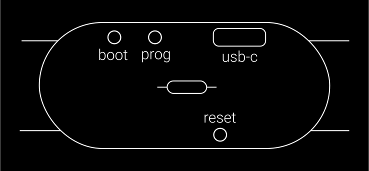
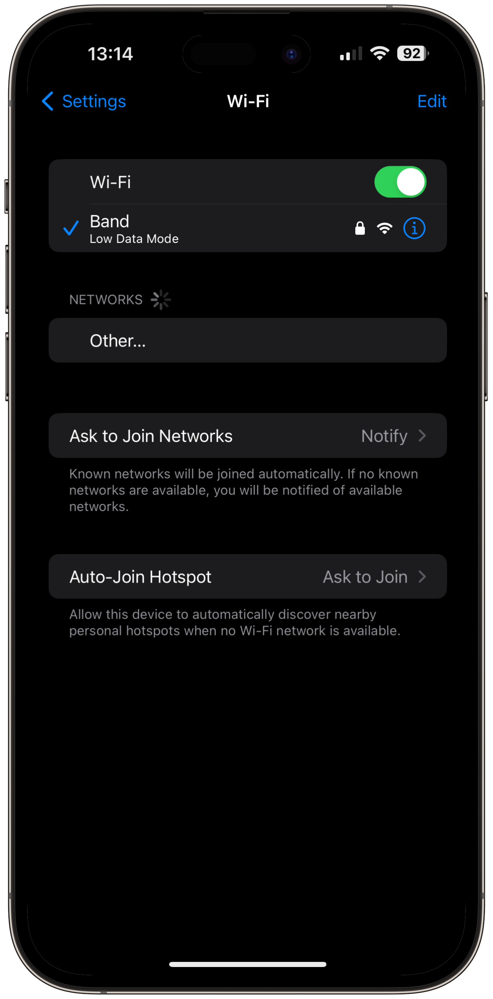

# Туториал по использованию браслета

## 👋 Введение

### ❗ Проблема

В современном мире каждый сталкивается с проблемой лени и прокрастинации. Люди часто получают удовольствие от того, что несёт им вред. Я же хочу сделать так, чтобы лень не мешала никому делать то, что для него действительно важно, учиться, развиваться и становится лучше.

### ✅ Решение

Я разработал браслет для повышения продуктивности и победы над ленью. Браслет настраивается с помощью удобного веб-интерфейса. После настройки подключается к интернету через Wi-Fi. Подключение к API различных сервисов позволяет контролировать выполнение многих задач. Если задача не выполняется, то браслет начинает нагреваться, тем самым стимулируя пользователя к работе или учёбе. Устройство создано на основе чипа ESP32, что позволяет пользователю загружать собственный Arduino код и применять его во множестве различных сценариев.

## 🔋 Зарядка

Браслет заряжается с помощью USB-C. Процесс зарядки можно увидеть на [http://10.1.1.1/battery](http://10.1.1.1/battery) (описано далее).

## 🕹️ Включение и кнопки

У браслета есть 3 кнопки утопленные в корпус. Чтобы их нажать, нужно использовать зубочистки или иголки. Возьми сразу две, т.к. нужны обе для некоторых комбинаций.

⚡ Включение / перезагрузка - нажми **reset**.

⚙️ Режим настройки - зажми **prog** и нажми **reset**. Светодиоды начнут переливаться радугой.

🔌 Выключение - зажми **boot** и **prog**, когда устройство включено. Загорится красный светодиод и плавно погаснет.

💾 Режим загрузки прошивки - зажми **boot** и нажми **reset**.

## 🪢 Регулировка ремешка

Инструкция по регулировке ремешка нарисована на коробке. Для регулировки потребуется маленькая плоская отвёртка идущая в комплекте.

## ⚙️ Основные настройки

Для настройки не нужно скачивать никакие приложения. Браслет можно настроить с помощью смартфона, планшета, ноутбука и любого другого устройства, которое способно подключаться к Wi-Fi и открывать сайты.

Сначала нужно включить режим настройки. Зажми кнопки prog и нажми reset. Светодиоды начнут переливаться радугой.

Браслет создаёт Wi-Fi точку, к которой нужно подключиться, чтобы его настроить. После ввода имени сети и пароля (по умолчанию **_Band_** и **_12345678_**), нужно зайти в браузер и перейти по адресу [http://**10.1.1.1**](http://10.1.1.1). В результате откроется главная страница настроек.
Затем нужно нажать на интересующую вкладку, далее будет описана каждая из них.  
Внизу у большинства вкладок находятся кнопки **Сохранить** и **Отменить**, благодаря которым заполненная форма либо отправляется на браслет и сохраняется на нём, либо изменения отменяются, то есть остаются значения, которые были на браслете.

### 🏠 Основные

Во вкладке можно выбрать имя для браслета и пароль, которые будут использоваться для подключения к настройкам.

<!-- > [!CAUTION]
> Выставление безопасного уровня нагрева является твоей задачей! -->

!!! danger "Важно"

    Выставление безопасного уровня нагрева является твоей задачей!

Также можно выставить подходящий лично тебе уровень нагрева от 0 до 255 (это не градусы, а мощность ШИМ, где 0 - нет нагрева, а 255 - максимальный нагрев). (Для регулирования мощности нагревателя используется ШИМ (Широтно Импульсная Модуляция). Этот метод работает за счёт пульсирующего включения и выключения напряжения. Плата способна генерировать ШИМ с 0 до 255, где 0 - полностью выключено, а 255 - сигнал подан постоянно.)

Внизу так же есть кнопки для перезагрузки и выключения браслета.

### 📡 Wi-Fi

Во вкладке Wi-Fi нужно ввести данные сети, к которой будет подключаться браслет.

Если хочешь подключиться к открытой сети, то оставь поле для пароля пустым.

Можно ввести сразу несколько сетей, а браслет будет подключаться к сети с наилучшим сигналом, что полезно, если нужно использовать браслет в разных помещениях.

Можно использовать режим модема, так же как обычный Wi-Fi, но это не всегда удобно. Режим модема на iPhone автоматически выключается, если к нему никто не подключен, что не позволяет его использовать для браслета. Android смартфон будет быстрее разряжаться.

Старайтесь находиться как можно ближе к источнику Wi-Fi, чтобы браслет работал корректно.

### 🔋 Аккумулятор

Во вкладке аккумулятор можно посмотреть текущий заряд аккумулятора и установить время сна после неудачной попытки подключения к Wi-Fi или при отсутствии расписания. Увеличение времени сна позволит сэкономить заряд аккумулятора.

### ⏰ Расписание

Во вкладке расписания вводятся правила, по которым будет действовать браслет в течении недели.

Для создания нового правила нужно нажать на кнопку с плюсом.  
Нужно выбрать один или несколько режимов работы (если включены, например Stepik и Codewars, то достаточно выполнять один из них). В некоторых случаях это бывает очень полезно, когда нужно, например, учиться на Stepik и повторять информацию в Anki одновременно.  
После чего нужно выбрать время начала и завершения правила и выставить дни недели, в которые оно будет работать.

Также можно менять правила местами с помощью стрелочек вверх и вниз или удалить, используя крестик. Расположение правил имеет значение, т.к. они проверяются сверху вниз, пока не будет найдено первое подходящее по времени и дню недели правило.

Если выбрать Sleep, то браслет будет отправляться в глубокий сон пока не закончится время правила.

При нажатии кнопки Сохранить на браслет отправляется POST запрос с JSON, в котором хранится информация о расписании.

### 💾 Импорт / экспорт

Настройки можно сохранить в формате JSON, а затем загрузить обратно на браслет, что очень полезно при обновлении файловой системы и в других ситуациях, когда настройки могут пропасть.

## 🎓 Подробности для изучения

- [Что такое API?](https://www.youtube.com/watch?v=fXa_2rllZTI)
- [Уроки Arduino и программирования](https://www.youtube.com/playlist?list=PLgAbBhxTglwmVxDDC5TSYUI91oZ0LZQMw)
- [Learn HTML forms in 8 minutes](https://www.youtube.com/watch?v=2O8pkybH6po)
- [Что такое ШИМ?](https://www.youtube.com/watch?v=FGV1snPOcas)
- [ШИМ сигнал в Arduino](https://www.youtube.com/watch?v=rCmaMST8qkg)
- [ESP32](https://ru.wikipedia.org/wiki/ESP32)
- [POST](<https://ru.wikipedia.org/wiki/POST_(HTTP)>)
- [JSON](https://ru.wikipedia.org/wiki/JSON)
