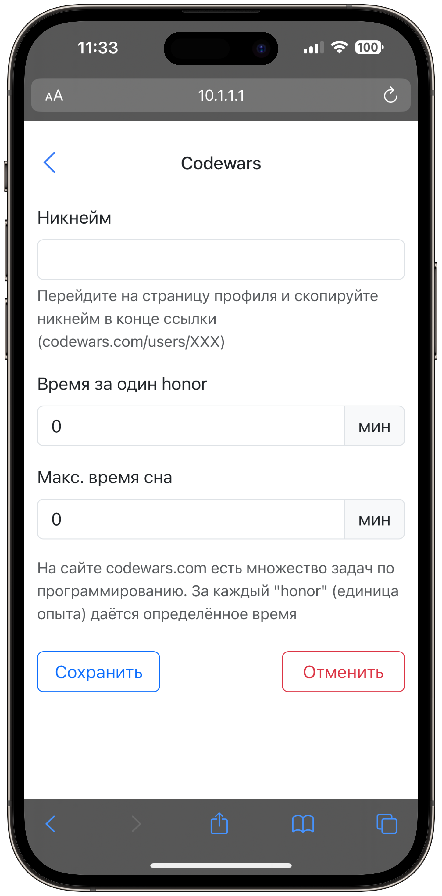

Некоторые образовательные сервисы предоставляют своё API, что позволяет браслету получить информацию о твоей активности.

Для каждого сервиса нужно ввести время, которое будет даваться за выполнение задачи. Кроме времени за выполнения одной задачи есть ещё максимальное время, чтобы, если сложится время несколько задач, конечное время не было слишком большим.

Если не решена ни одна задача, то браслет начнёт нагреваться. Если задача выполнена, то браслет уходит в сон на время `минимум(время_за_задачу * колво_задач, макс_время_сна)`.

## Stepik

[Stepik.org](https://stepik.org) - образовательная платформа, на которой есть огромное кол-во качественных курсов по разным темам. В большинстве курсов, после теории, предлагаются практические задачи. Число решённых задач в конкретный день можно посмотреть в профиле или с помощью API.

Перейди на страницу профиля и скопируй цифры в конце ссылки (stepik.org/users/USER_ID).

## Codewars

[Codewars.com](https://codewars.com) - сайт с задачами по программированию, за решение которых начисляются баллы. Их кол-во и другую информацию можно посмотреть в профиле или с помощью API.

Перейди на страницу профиля и скопируй никнейм в конце ссылки (codewars.com/users/XXX).

За каждый `honor` (единица опыта) даётся определённое время.

## Leetcode

[Leetcode.com](https://leetcode.com) - сайт с задачами по программированию, за решение которых начисляются баллы. Их кол-во и другую информацию можно посмотреть в профиле или с помощью API.

Перейди на страницу профиля и скопируй никнейм в конце ссылки (leetcode.com/u/USERNAME/).

За каждый тип задач можно получать разное время.

## 🛠️ Подробности для разработчиков

### Stepik

- [Stepik REST API](https://stepik.org/api/docs/)
- [Stepik API GitHub](https://github.com/StepicOrg/Stepik-API)
- [https://stepik.org/api/user-activities/USER_ID](https://stepik.org/api/user-activities/USER_ID)

### Codewars

- [Codewars API Reference](https://dev.codewars.com/)
- [https://codewars.com/api/v1/users/USERNAME](https://codewars.com/api/v1/users/USERNAME)

### Leetcode

- [Leetcode API GitHub](https://github.com/JeremyTsaii/leetcode-stats-api)
- [https://leetcode-stats-api.herokuapp.com/USERNAME](https://leetcode-stats-api.herokuapp.com/USERNAME)
